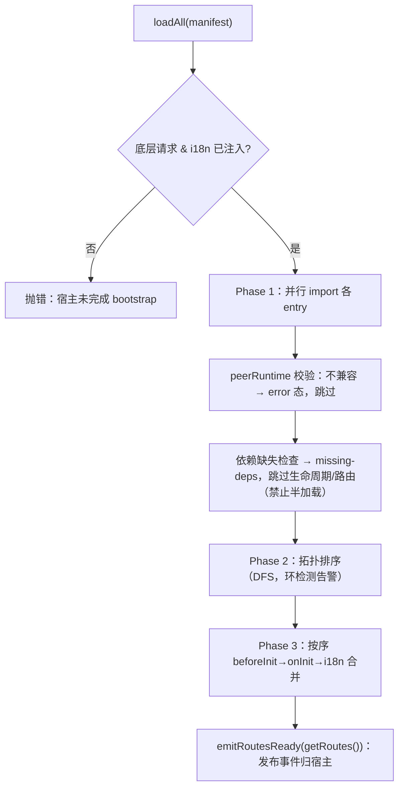

# @oj-module/core · 开发者文档

> 模块系统最小核心（L0）。从 `@oj-module/runtime` v0.1.10 的 module-loader 蒸馏泛化而来，
> **零 UI / 零布局 / 零 antd / 零 zustand 意见**——只承载模块系统的引擎与注册原语，宿主
> （本项目 `@oj-module/plane-runtime`，或任何 RR7/RR8 宿主）经 importmap 消费。
> 源文件约 1200 行（PRD §2 目标 ≤1200 LOC 毛量口径，已收口）。
>
> 背景与战役关系见 `docs/ever/prd/oj-plane-runtime-prd.md`（R 战役）。本包是 PRD §4 的落地产物。

---

## 0. 它是什么 / 不是什么

**是**

- 模块加载引擎：`loadAll` 并行加载 → peerRuntime 校验 → 依赖拓扑排序 → 生命周期 → 路由就绪事件。
- 一组**注册原语**（register 表）：store / apiPrefix / authProvider / headerProvider /
  systemApi / notificationsApi / uploadApi / layout / menu / slot。
- 路由纯函数工具：`resolveRouteLayouts`（含 U7 叶子布局修复）、`flattenRoutes`、
  `addRouteIdByPath`、`resolveLayoutComponent`。
- 类型契约：`ModuleDefinition<R>`、`ModuleContext`、`RouteMeta`、`AuthProvider`、菜单工厂等。

**不是**

- 不引任何 UI 框架的布局组件（布局名由宿主 bootstrap 注入，core 只做注册表解析）。
- 不自带 zustand / i18next 实例——二者均由宿主注入（见 §3）。
- 不含 `utils/request` 实现（那是 oj 后端耦合，归 plane-runtime services）；core 只定义
  `ModuleRequest` 结构契约，底层实例由宿主注入。
- 不实现路由树挂载——core 产出 `AppRouteRecordRaw[]`，由宿主挂进 RR 树（catch-all 归宿主）。

---

## 1. 安装与运行面

```jsonc
// package.json 摘要
{
  "name": "@oj-module/core",
  "version": "0.1.1",
  "type": "module",
  "exports": { ".": { "types": "./dist/index.d.ts", "default": "./dist/core.js" } },
  "peerDependencies": {
    "i18next": "^25.10.0 || ^26",
    "react": "^19",
    "react-router": "^7 || ^8"
  }
}
```

- **peer 口径**：react 19、react-router `^7 || ^8`（core 对 RR 仅类型级 + `Outlet`，不锁版本行为）、
  i18next 25/26。core 由 oj-module 仓一次性构建为 tgz，被各宿主 dev/prod 共用——故**不烤入
  `import.meta.env.DEV`**，DEV 旗标由宿主 bootstrap 注入（见 §3 ③）。
- **底层请求**：host 注入一个 `ky` 实例（或任何满足 `ModuleRequest` 结构契约的对象）。
  core 的 scoped request 在其上叠加前缀边界校验与凭据外泄防护（见 §7）。

---

## 2. 分层与依赖关系

```mermaid
graph TD
    subgraph HOST["宿主（plane-runtime / 任意 RR7·8 宿主）"]
        BOOT["bootstrap 注入 ④ 钩子"]
        RR["react-router 树（catch-all 归宿主）"]
    end
    subgraph CORE["@oj-module/core（本包）"]
        ENG["module-loader 引擎<br/>loadAll / 拓扑排序 / peerRuntime 门 / unload"]
        REG["注册原语<br/>store·apiPrefix·authProvider·headerProvider<br/>systemApi·notificationsApi·uploadApi·layout·menu·slot"]
        RT["路由纯函数<br/>resolveLayouts / flatten / addRouteId / resolveLayout"]
        CTX["ModuleContext / ModuleDefinition&lt;R&gt;<br/>RouteMeta / AuthProvider / MenuFactory"]
    end
    BOOT -->|setUnderlyingRequest / setI18nBridge / setDevFlag / setRouteAuthzProvider| CORE
    ENG -->|onRoutesReady 事件| RR
    REG -.被模块经 ctx.register 写.-> ENG
    RT -.被 getRoutes 调用.-> ENG
```

---

## 3. 宿主引导（bootstrap）—— 四件注入，顺序无关但须在 `loadAll` 之前

core 在 v1 直蒸时做了**三处事件化/去意见化**（PRD §4），因此宿主必须先注入四样东西，否则
`loadAll` 直接抛错：

| 注入函数 | 注入什么 | 必填 | 说明 |
| --- | --- | --- | --- |
| `setUnderlyingRequest(req)` | 底层请求实例（ky） | **是** | `loadAll` 前置校验：缺则抛 `[module-loader] 宿主未完成 bootstrap 注入：请先调用 setUnderlyingRequest(request) 与 setI18nBridge(i18n) 再 loadAll。` |
| `setI18nBridge(i18n)` | 宿主 i18next 工作实例 | **是** | 仅用其 `addResourceBundle`；**禁默认单例**（避免「最后 init 者赢」绑定险） |
| `setDevFlag(bool)` | DEV 旗标 | 否（默认 false） | 替代 v1 的 `import.meta.env.DEV`，core 零 env 烤制 |
| `setRouteAuthzProvider(() => {roles,permissions})` | 惰性身份钩子 | 否（默认空身份） | 替代 v1 `useUserStore`；路由 `requiredRoles/Permissions` 前置过滤 |

```ts
// host bootstrap（示意）
import ky from "ky";
import { createBrowserRouter } from "react-router";
import i18n from "<宿主 i18next 实例>";
import {
  setUnderlyingRequest,
  setI18nBridge,
  setDevFlag,
  setRouteAuthzProvider,
  loadAll,
  onRoutesReady,
  getRoutes,
} from "@oj-module/core";
import type { ModuleRequest } from "@oj-module/core";

// ① 底层请求：宿主用 ky 构建（非 axios）
const http = ky.create({ prefixUrl: "/api", timeout: 30000 });
setUnderlyingRequest(http as unknown as ModuleRequest);

// ② i18n 实例收敛
setI18nBridge(i18n);

// ③ DEV 旗标（Vite define 注入，core 不自烤）
setDevFlag(import.meta.env.DEV);

// ④ authz 钩子：返回当前用户角色/权限（空身份 = 不按角色过滤路由）
setRouteAuthzProvider(() => ({
  roles: currentUser.roles,
  permissions: currentUser.permissions ?? [],
}));

// 加载 manifest → 路由就绪事件 → 挂进 RR 树
const manifest = await fetch("/manifest.json").then((r) => r.json());
await loadAll(manifest);

onRoutesReady((routes) => {
  router = createBrowserRouter([
    ...getRoutes(),                 // core 产出的路由（已补 id、已解布局）
    { path: "*", element: <NotFound /> }, // catch-all 归宿主
  ]);
});
```

> **关键**：core 不持有 router 实例，也不挂路由。它只通过 `onRoutesReady` 发布
> `AppRouteRecordRaw[]`，由宿主 `createBrowserRouter` 挂载。模块**禁止声明 `*`**。

---

## 4. 模块定义（ModuleDefinition）

```ts
interface ModuleDefinition<R = AppRouteRecordRaw> {
  name: string;
  description: string;
  version: string;
  routes: R[];
  lifecycle?: ModuleLifecycle;
  i18n?: ModuleI18n;          // { [locale]: () => Promise<Record<string,unknown>> }
  config?: ModuleConfig;      // requiredRoles / requiredPermissions / dependencies
  peerRuntime?: string;       // semver 范围，不兼容则拒绝加载并显式报错
}
```

- `R` 泛型（PRD §4）：默认 `AppRouteRecordRaw`（框架路由）；compat 桥可换入宿主原形路由类型，
  由 `compatDefineModule` 翻译——core 本身不关心具体路由形状。
- `peerRuntime`：精确版 / `^x.y.z` / `~x.y.z` / `>=a <b` / `*` 均支持；超纲形态一律判 false
  （拒绝加载而非静默放行，比 v1 安全）。详见 §9。

### 4.1 一个最小模块 entry

```ts
// src/projects/entry.ts
import type { ModuleDefinition, NavigationItem } from "@oj-module/core";
import { ProjectsList } from "./pages/ProjectsList";
import { IconProjects } from "./icons";

const definition: ModuleDefinition = {
  name: "projects",
  description: "项目域模块",
  version: "1.0.0",
  peerRuntime: ">=0.1.0",
  routes: [
    {
      path: "/:workspaceSlug/projects",
      Component: ProjectsList,
      handle: { title: "项目", layout: "container", keepAlive: true },
    },
  ],
  lifecycle: {
    beforeInit: async (ctx) => {
      // 登记 API 前缀：此后 ctx.utils.request 仅放行命中此前缀的 URL（见 §7）
      ctx.register.apiPrefix("/api/projects");
    },
    onInit: async (ctx) => {
      // 菜单贡献 = 工厂（不是静态数组）：href 渲染期现算（见 §8）
      ctx.register.menu((params) => [
        {
          key: "projects",
          name: "项目",
          href: `/${params.workspaceSlug}/projects`,
          icon: IconProjects,
          access: [],
          shouldRender: true,
          sortOrder: 10,
          i18n_key: "sidebar.projects",
        } satisfies NavigationItem,
      ]);
    },
  },
  i18n: {
    "zh-CN": () => import("./locales/zh-CN.json"),
    "en-US": () => import("./locales/en-US.json"),
  },
};

export default definition;
```

---

## 5. 模块上下文与注册原语（ModuleContext）

每个模块在加载时被注入一个 `ModuleContext`，通过 `ctx.register.*` 写注册表。**所有注册先到先得
（菜单覆盖语义），模块卸载时自动注销**。

| `ctx.register.*` | 落点 | 备注 |
| --- | --- | --- |
| `store(name, store)` | `getRegisteredStore(name)` | 宿主 `getRegisteredStore` 桥接（compat 11 点写穿用） |
| `apiPrefix(prefix)` | 模块前缀集合（可多个，去重） | 一模块多个 scoped client；顺序 = 登记序 |
| `authProvider(p)` | `getAuthProvider()` | 全量接管 login/logout/getUserInfo |
| `headerProvider(p)` | `currentHeaderProvider()` | 惰性求值，追加非替换，同名头后写为准 |
| `systemApi(p)` | `getSystemApiProvider()` | 角色/菜单类内置 API 全量接管 |
| `notificationsApi(p)` | `getNotificationsApiProvider()` | 通知四方法全必填 |
| `uploadApi(p)` | `getUploadApiProvider()` | `action` URL + 动态 `headers()` |
| `layout(name, component)` | `registerLayout` | 注册新布局名；内建名由宿主 bootstrap 登记 |
| `menu(factory)` | `registerModuleMenu` | **core 新增**：工厂而非静态数组（§8） |
| `registerSlot(slot, node)` | `useSlotNodes` | 布局插槽片段，卸载即消失 |

`ctx.utils.request`：按本模块 apiPrefix 收敛的 scoped client（§7）。

### 5.1 生命周期（ModuleLifecycle）

```ts
interface ModuleLifecycle {
  beforeInit?: (ctx) => Promise<void>;
  onInit?:     (ctx) => Promise<void>;
  onActivate?: (ctx) => Promise<void>;   // ⚠️ loadAll 不调用，归宿主/壳显式触发
  onDeactivate?:(ctx) => Promise<void>;
  onDestroy?:  (ctx) => Promise<void>;
}
```

`loadAll` 的 Phase 3 只执行 `beforeInit → onInit → i18n 合并`；`onActivate` 不在加载面（实测 R0-3）。
生命周期抛错 → 模块置 `error` 态，其余模块不受影响。

---

## 6. 加载引擎 loadAll



- **并行加载**：Phase 1 用 `Promise.all` 并行 import，按 `entry.entry` 动态加载（支持本地路径或远程 URL）。
- **peerRuntime 不兼容**：显式失败（`console.error` + `status:"error"`），**不静默成功**。
- **依赖缺失**：置 `missing-deps`，跳过其生命周期与路由注册，避免半加载态。
- **拓扑排序**：基于 `config.dependencies` 的 DFS；环形依赖告警后截断（不崩溃）。

### 6.1 读取与卸载

| 函数 | 作用 |
| --- | --- |
| `getModules()` / `getModule(name)` | 全部实例 / 单实例（`status` 见下） |
| `getRoutes()` | 已加载模块路由，经 `resolveRouteLayouts` + `addRouteIdByPath`；按 authz 前置过滤 |
| `onRoutesReady(cb)` | 订阅路由就绪事件，返回取消函数（宿主挂载 RR 树用） |
| `unloadModule(name)` | `onDestroy` → 清插槽/菜单/provider/布局 → 移除实例；其余模块不受影响 |
| `getRegisteredStore(name)` | 读模块注册的 store（宿主桥接用） |
| `getKeepAliveExcludes()` / `getAllRoutePaths()` | KeepAlive 排除键 / 全部路由键 |

`ModuleInstance.status`：`pending | loading | loaded | active | error | missing-deps`。

---

## 7. 请求作用域（scoped request）与凭据防护

core 的 `ctx.utils.request` 是宿主 ky 实例之上的一层**边界守卫**（`createScopedRequest`）：

1. **前缀边界校验**：URL 须命中本模块登记的任一 `apiPrefix`（段边界匹配 + `../` 折叠）。裸
   `startsWith` 会误放兄弟前缀（`/sys` → `/sysadmin`），故先做 `new URL().pathname` 归一化再匹配。
   越界即抛 `请求越界` 错误。
2. **凭据外泄防护**：剥离逐请求 `options` 里的 `prefix` / `prefixUrl`——否则
   `{ prefix: "https://evil.com" }` 会带 Bearer 打到任意外域。
3. **惰性前缀**：可先登记后请求（`apiPrefix` 在 `beforeInit` 调，请求在 `onInit` 之后发）。

```ts
// 模块内使用（无需 import ky / axios）
await ctx.utils.request.get("/projects");
// 等价于底层 ky，但被锁定在 "/api/projects" 等已登记前缀内
```

> **axios → ky**：上游战役决议不采用 axios，直接采用 ky。core 的 `ModuleRequest` 结构契约
> 与 ky 实例同形（可调用 + `.get/.post/...`），宿主注入 ky 实例即可，core 零请求栈依赖。

---

## 8. 菜单工厂（渲染期现算）

v1 菜单用静态数组、path-as-key，逼出全量 `hideInMenu` 纪律——病根在于把
`workspaceSlug/projectId` 烤死在注册时刻。core 改为**工厂**：

```ts
ctx.register.menu((params: { workspaceSlug?: string; projectId?: string }) =>
  NavigationItem[]);
```

- 宿主每次切工作区/项目，用新 `params` 调 `getRegisteredMenus(params)` 即得新 href。
- `NavigationItem` 字段同名同义于上游 `TNavigationItem`：`key / name / href / icon / access /
  shouldRender / sortOrder / i18n_key`。
- `access` 类型仅声明为 `readonly unknown[]`：上游枚举（`EUserPermissions` / `EUserProjectRoles`）
  ↔ oj roles 字符串的映射表归 plane-runtime 门禁层，core 不引该意见。
- **core 只登记不做取舍**：`filter(shouldRender)` / `sort(sortOrder)` 归宿主菜单工厂。

---

## 9. peerRuntime 版本门（semver）

`satisfiesSemver(version, range)` 支持：`*` / 空 / 精确 / `^x.y.z` / `~x.y.z` /
`>=a <b`（空格合取）。超纲形态一律 false。

- `version` = manifest 的 `runtimeVersion`（宿主实际版本）。
- `range` = 模块 `definition.peerRuntime`（优先）或 manifest 条目的 `peerRuntime`。
- 判定失败 → 模块 `error` 态、不加载、显式报错（不静默放行）。
- compat 窗口期 v1 模块声明 `">=0.1.9"` 针对 v1 版本轴，需填 compat 假名（如 `0.1.x-compat`）
  以恢复 core 门甄别力（PRD §7 R5）。

---

## 10. 路由工具（纯函数）

| 函数 | 作用 |
| --- | --- |
| `resolveRouteLayouts(routes)` | 按 `handle.layout` 注入布局组件。**U7 修复**：直挂 `Component` 的叶子路由，layout 提为其父、原页降为 index 叶子（v1 只对「无 Component 有 children」的路由生效，导致叶子 `handle.layout` 不生效） |
| `resolveLayoutComponent(handle)` | 取单布局组件；未知名 warn-once 回落 `Outlet` |
| `flattenRoutes(routes)` | 扁平化为 `path → route`（index 键 = 父 path + `/`） |
| `addRouteIdByPath(routes)` | 补 `id`（默认 = 绝对路径）；菜单 key 同规则，保证 `match.id` 命中菜单项 |
| `RouteMeta` | `handle` 元信息：`title/icon/order/roles/permissions/keepAlive/layout/login/...` |

内建布局名（`container` / `parent` / `fullscreen` / `none`）由**宿主 bootstrap 经
`registerLayout` 登记**；模块也可经 `ctx.register.layout` 注册自定义名。core 不引任何布局实现。

---

## 11. i18n 贡献（实例收敛）

- 模块在 `i18n` 里声明 `{ [locale]: () => Promise<资源> }`（动态 import JSON）。
- `loadAll` Phase 3 调 `mergeModuleI18nResources(i18nBridge, definition)`：
  namespace = 模块名，资源挂 `translation` 键下（`default` 导出自动解包）。
- **实例收敛**：i18next 实例由宿主经 `setI18nBridge` 注入，**core 不持有默认单例**（避免多包
  各 init 互相覆盖）。
- `organizeLanguageFiles(files)`：把 `import.meta.glob` 结果按文件名聚合成语言包（纯函数；
  glob 属宿主构建面，core 不引）。

---

## 12. 插槽（slots）

布局片段机制：模块经 `ctx.registerSlot(slotName, node)` 挂载，宿主布局组件用
`useSlotNodes(slotName)` 订阅渲染，卸载即消失。

| 函数 | 作用 |
| --- | --- |
| `useSlotNodes(slotName)` | React hook，插槽节点变化时重渲染（基于 `useSyncExternalStore`） |
| `getSlotNodes(slotName)` | 纯读当前全部节点（注册序 = 对象值序） |
| `subscribe(cb)` | 低级订阅（测试/高级宿主可用） |
| `resetSlots()` | 重置（测试用） |

组织：`slotName → moduleName → node`，同名重注册覆盖，卸载按模块清理。

---

## 13. 类型速查

| 类型 / 函数 | 来源文件 | 一句话 |
| --- | --- | --- |
| `ModuleDefinition<R>` | `types.ts` | 模块 entry 导出类型；`R` 默认 `AppRouteRecordRaw` |
| `ModuleContext` | `types.ts` | 宿主注入能力：`module/utils/register/registerSlot` |
| `ModuleRequest` | `types.ts` | 底层请求结构契约（ky 同形） |
| `ModuleLifecycle` | `types.ts` | `beforeInit/onInit/onActivate/onDeactivate/onDestroy` |
| `ModuleConfig` | `types.ts` | `requiredRoles/requiredPermissions/dependencies` |
| `Manifest` / `ManifestModuleEntry` | `types.ts` | manifest.json 格式 |
| `AppRouteRecordRaw` / `RouteMeta` | `router/types.ts` | 路由记录与 `handle` 元信息 |
| `AuthProvider` / `HeaderProvider` / `SystemApiProvider` / `NotificationsApiProvider` / `UploadApiProvider` | `providers/types.ts` | 各 provider 契约（core 只定义类型，实现宿主注入） |
| `NavigationItem` / `MenuFactory` / `MenuFactoryParams` | `menu.ts` | 菜单项 + 工厂 |
| `setUnderlyingRequest` / `setI18nBridge` | `module-loader/index.ts` | 底层请求与 i18n 实例注入（loadAll 前置校验） |
| `setDevFlag` / `setRouteAuthzProvider` | `host.ts` | DEV 旗标与 authz 钩子注入 |
| `onRoutesReady` / `emitRoutesReady` | `host.ts` | 路由就绪事件（事件化①） |
| `getRouteAuthz` | `host.ts` | 取当前身份（事件化②） |
| `loadAll` / `getRoutes` / `getModules` / `getModule` / `unloadModule` | `module-loader/index.ts` | 加载引擎 |
| `createScopedRequest` | `request/scoped.ts` | 前缀边界 + 凭据防护的请求守卫 |
| `satisfiesSemver` | `module-loader/semver.ts` | peerRuntime 范围判定 |
| `registerLayout` / `getRegisteredLayout` / `unregisterLayouts` | `layout/layout-registry.ts` | 布局注册表 |
| `registerModuleMenu` / `getRegisteredMenus` / `unregisterModuleMenus` | `menu.ts` | 菜单工厂注册/聚合 |
| `mergeModuleI18nResources` / `organizeLanguageFiles` | `locales/index.ts` | i18n 贡献合并 |
| `useSlotNodes` / `getSlotNodes` / `subscribe` / `resetSlots` | `module-loader/slots.ts` | 插槽 |
| `resolveRouteLayouts` / `resolveLayoutComponent` | `router/utils/resolve-layout.ts` | 布局解析（含 U7） |
| `flattenRoutes` / `addRouteIdByPath` | `router/utils/*` | 路由扁平化 / 补 id |
| `getKeepAliveExcludes` / `getAllRoutePaths` | `module-loader/keep-alive.ts` | KeepAlive 排除键计算 |

---

## 14. 与 v1 `@oj-module/runtime` 的关系

- v1 runtime（v0.1.10）**只读**（PRD D-R7），core 不改动它。core 是从 v1 module-loader
  **蒸馏泛化**出的更小核心。
- v1 模块在 compat 窗口期经 `plane-runtime/compat` 适配器翻译为 core `ModuleDefinition<R>`，
  再跑在 v2 宿主内（详见 `oj-plane-runtime-compat-adapter-design.md`）。
- 超集原则：core 的 `ModuleContext` 以 v1 契约为蓝本做**超集**（同名同义 + 新增 `register.menu`），
  使 v1 模块 entry 可近乎原样迁移。

---

## 15. 测试

`vitest` 套件覆盖：loader 全生命周期 + 三处事件化、slots、semver、`resolve-layout`、
`locales`、`scoped` 请求边界。运行：

```bash
pnpm --filter=@oj-module/core test
```

测试用 `data:` URL 动态 import 模拟模块 entry（node 原生支持），生命周期调用序经
`globalThis.__order` 通道回传断言。

---

## 16. 构建

```bash
pnpm --filter=@oj-module/core build   # vite build && tsc -p tsconfig.dts.json
```

产出 `dist/core.js` + `dist/*.d.ts`。发版沿用 oj-module 仓 tgz + 钉版先例；importmap 版本
唯一真源 = plane-runtime 侧 versions 生成脚本，`tools/m0-gates.sh` 链增「core 版本 ↔
importmap 一致性」检查（防两仓钉版失联）。
